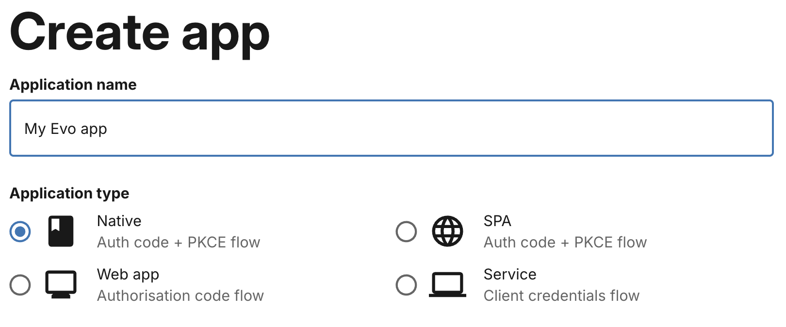
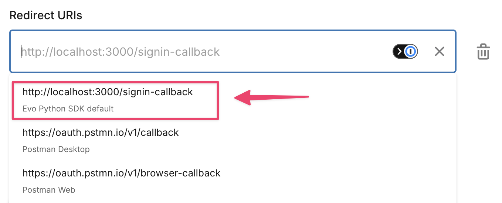
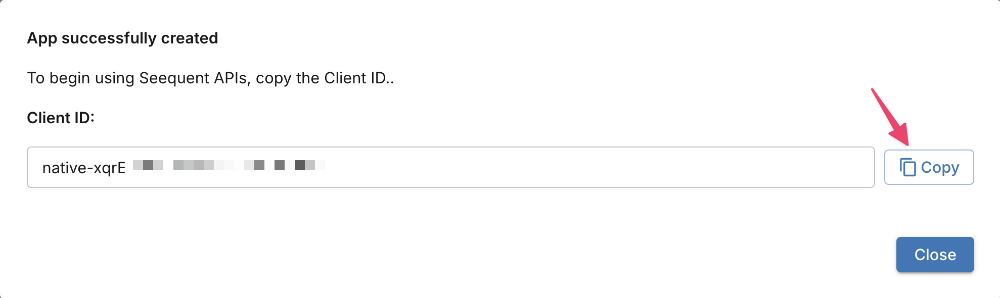

# Evo Code Samples

Welcome to the Evo Python SDK code samples! This directory contains comprehensive Jupyter notebook examples that demonstrate how to use the various Evo APIs for geoscience data management and analysis.

## 📋 Prerequisites

- **Evo app**: You need a [registered app](https://developer.seequent.com/my-apps)
- **Python**: Version 3.10 or higher
- **Jupyter Environment**: JupyterLab, VS Code, or another Jupyter notebook editor

## 🚀 Quick start

### 1. Register an Evo app

Register an Evo app in the [Seequent Developer Portal](https://developer.seequent.com/my-apps) to get your client credentials. For more in-depth instructions, follow this [guide](https://developer.seequent.com/docs/guides/getting-started/apps-and-tokens) on the Seequent Developer Portal.

a. In a new browser tab or window, visit [https://developer.seequent.com/](https://developer.seequent.com/) and sign in.


b. Click **My apps** in the toolbar. You may need to agree to the developer terms and conditions before proceeding.


c. Click **Create app**.


d. Enter an application name and select the **Native** application type.



e. Click **Add new redirect URI**.


f. Click inside the text box to reveal a menu of common defaults. If you intend to use the bundled Jupyter notebooks, select **Evo Python SDK default**.



g. Click **Create app**.


h. The next screen displays the unique **Client ID** of your app. Save a copy - you will need it to run the Jupyter notebooks. You can find this ID again by visiting [My apps](https://developer.seequent.com/my-apps) at a later date.



### 2. Obtain a local copy of this repository

If you want to focus on the code samples, or if you aren't comfortable using Git, download a copy of this repository as a ZIP file. Visit [https://github.com/SeequentEvo/evo-python-sdk](https://github.com/SeequentEvo/evo-python-sdk) and follow the instructions below:


Alternatively, if you are comfortable using Git:

```shell
git clone https://github.com/SeequentEvo/evo-python-sdk.git
```

### 3. Set up your environment

You must first install the package manager `uv`. This will make it easy to set up your Python environment.

Follow the instructions below for [Windows](#windows), [macOS](#macos) or [Linux](#linux).

#### Windows
1. Find the local copy of this repository in **Windows Explorer**. It will be called **evo-python-sdk-main** if you downloaded as a ZIP file.
1. Right-click on the folder and choose **Open in Terminal**.

    

1. Enter the following command to install `uv`.
    ```pwsh
    powershell -ExecutionPolicy Bypass -c "irm https://astral.sh/uv/$(Get-Content ./UV_VERSION)/install.ps1 | iex"
    ```

1. Move to the **code-samples** directory.
    ```pwsh
    cd code-samples
    ```
    
1. Install the Python dependencies.
    ```pwsh
    uv sync
    ```

### macOS
1. Find the local copy of this repository in **Finder**. It will be called **evo-python-sdk-main** if you downloaded as a ZIP file.
1. Open the folder so that you can see it's contents.
1. On the *Path bar* at the bottom of the window, right-click on **evo-python-sdk-main**.
    
    HINT: If the *Path bar* isn't visible, select **Show Path Bar** from the **View** menu.

     

1. From the pop-up menu, select **Open in Terminal**.

    

1. Enter the following command from the root directory of the repository to install `uv`.
    ```bash
    ./scripts/install-uv.sh
    ```

1. Move to the **code-samples** directory.
    ```bash
    cd code-samples
    ```

1. Install the Python dependencies.
    ```bash
    uv sync
    ```

### Linux

NOTE: This example is based on [Ubuntu](https://ubuntu.com), but other Linux environments will operate in a similar way.

1. Find the local copy of this repository in **Files**. It will be called **evo-python-sdk-main** if you downloaded as a ZIP file.
1. Right-click on the folder and choose **Open in Terminal**.

    

1. Enter the following command from the root directory of the repository to install `uv`.
    ```bash
    ./scripts/install-uv.sh
    ```

1. Move to the **code-samples** directory.
    ```bash
    cd code-samples
    ```

1. Install the Python dependencies
    ```bash
    uv sync
    ```

### 4. Run the notebooks

> [!TIP]
> Before running these notebooks, ensure that you have access to at least one Evo workspace. You can do this in two ways:
>
> - Ask a colleague to add you to an existing workspace.
> - Create a workspace by signing in to the [Evo portal](https://evo.seequent.com/), opening the **Workspaces** tab, clicking the **Create workspace** button, and then following the instructions.
>
>   

From the **code-samples** directory, launch Jupyter.

```bash
uv run jupyter notebook
```

> [!TIP]
> If you are using VS Code or another Python IDE, simply open one of the `.ipynb` files.

Jupyter will list everything in the **code-samples** directory, and you can click to browse each section.

Before diving into the geoscience code samples, we recommend that you first test your Evo app to make sure your client credentials are set up correctly.


a. Click to open **auth-and-evo-discovery**.
b. Click to open **native-app-token.ipynb**.
c. Enter your **client ID** and **callback URL** from when you registered your Evo app.


d. Run the first code cell by pressing Shift+Enter or by pressing the Play button in the toolbar.

e. Run the next code cell. You may see red warning text - this is normal.

f. If everything is set up correctly, your web browser should open a new tab and ask you to sign in with your Bentley ID. Once you have signed in and granted access to the app, return to the tab with Jupyter running.

g. Using the widget that appears under the code cell, select your Organisation, Hub and Workspace.

h. Run the next code cell. You should see a printout of your Evo hub URL, organisation ID and workspace ID.

The values printed in the last cell are required for almost all Evo API calls. This is because all Evo data is stored in a workspace that exists in your assigned Evo hub and organisation.

Now that you know how Evo auth works, explore the other Jupyter notebooks. They all require your client ID and callback URL, just like in this example.

## 📚 Sample categories

### 🔐 Authentication & discovery
**📁 [auth-and-evo-discovery](auth-and-evo-discovery/)**

Learn about Evo auth and the Evo Discovery service:
- `native-app-token.ipynb` - Authentication for desktop applications
- `service-app-token.ipynb` - Authentication for service applications  
- `evo-discovery.ipynb` - Find your organization ID and hub URL

### 🧊 Block models
**📁 [blockmodels](blockmodels/)**

Block model workflow examples using both SDK and direct API approaches:
- `sdk-examples.ipynb` - High-level Block Model SDK examples (recommended)
- `api-examples.ipynb` - Direct API calls for advanced use cases

These notebooks demonstrate:
- Creating regular block models
- Adding and updating columns
- Querying data with bounding boxes
- Working with PyArrow tables and pandas DataFrames

### 🗂️ File operations
**📁 [files](files/)**

Basic unstructured file management operations:
- Upload files to Evo
- Download files from Evo
- List and organize files
- Delete files
- Bonus: Sample Python scripts for file Input-Output in Evo

### 🌍 Geoscience objects
**📁 [geoscience-objects](geoscience-objects/)**

Publish and download various geoscience data types:
- Drilling campaigns and downhole collections
- Point sets and triangular meshes
- 2D regular grids
- Complex geoscience data structures

*Note: Some notebooks have platform-specific requirements (e.g., Windows-only dependencies)*

### 🏢 Workspace management
**📁 [workspaces](workspaces/)**

Administrative operations:
- Manage Evo workspaces
- Handle user roles and permissions
- Bonus: Move geoscience objects from one workspace to another

### ✨ Extras
**📁 [common-tasks](common-tasks/)**

This section includes tasks that are common across many of the Evo APIs.

Advanced file processing:
- Working with Parquet data files
- Data manipulation

## 🔧 Running a sample

1. **Open the notebook** in your preferred editor.
1. **Update the first cell** with your client ID and callback URL.
1. **Run the authentication cell** - this will open your browser for Bentley ID sign-in.
1. **Select your organisation, instance and workspace** using the provided widget.
1. **Continue with the remaining cells** in order.

## 💡 Tips for success

- **Always start with authentication**: The **auth-and-evo-discovery** code samples are the best place to get started.
- **Check platform requirements**: Some geoscience-objects code samples are Windows-specific.
- **Use virtual environments**: Keep dependencies isolated for each project.
- **Follow notebook order**: Run cells sequentially for best results.
- **Keep credentials secure**: Never commit tokens or credentials to version control.

## 📖 Additional resources

- [Seequent Developer Portal](https://developer.seequent.com/)
- [Seequent Community](https://community.seequent.com/group/19-evo)
- [Evo Python SDK README](../README.md)

## 🆘 Getting help

If you encounter issues:
1. Check that you've completed the authentication setup.
2. Verify your Python version (3.10+).
3. Ensure all requirements are installed.
4. Visit the [Seequent Community](https://community.seequent.com/group/19-evo) for support.
5. Check the [GitHub issues](https://github.com/SeequentEvo/evo-python-sdk/issues) for known problems.

Happy coding with Evo! 🎉
