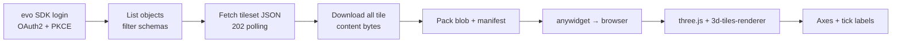

# Building a Jupyter Widget for the Evo Visualisation API

A complete, cross-platform recipe for rendering **Evo geoscience objects** inside a Jupyter
notebook — surfaces, meshes, pointsets, downhole data and grids — displayed alongside a **3D axis
frame with numbered tick labels**, just like the native EvoViewer app.

This folder is self-contained. Copy it into your Python repository, install the requirements, and
adapt as needed.

> **Scope.** This widget deliberately covers *geoscience objects served by the Evo Visualisation
> service only*. **Block models and Central objects are out of scope** — they use different
> services and rendering paths.

---

## 1. What we are building

The native app follows a one-way pipeline:

```
Sign in → Discover instances → Choose workspace
  → Browse objects → Fetch tileset (visualisation service)
  → Parse tile tree → Render each frame (Metal)
```

We reproduce the same pipeline in Python + JavaScript, swapping Metal for a WebGL renderer that
runs anywhere Jupyter does:



### Why this architecture

| Concern | Decision | Why |
|---|---|---|
| **Auth** | Reuse the Evo Python SDK (`evo.notebooks.ServiceManagerWidget`) | It already implements the exact OAuth2 + PKCE flow the app uses against Bentley IMS, plus discovery and workspace selection. No need to re-implement it. |
| **Tile transport** | Download tileset + all content **in Python**, then hand bytes to the browser | Tile content URIs resolve back to the Evo hub and need a Bearer token. Fetching them in the browser would mean shipping tokens client-side *and* fighting CORS. Downloading server-side sidesteps both. |
| **Renderer** | `anywidget` + `three.js` + `3d-tiles-renderer` | `anywidget` renders identically in JupyterLab, Notebook 7, VS Code and Colab. `3d-tiles-renderer` speaks OGC 3D Tiles 1.1 — the exact format the Visualisation service emits. |
| **Axes/labels** | `CSS2DRenderer` labels + line geometry, rebuilt from the tileset bounding box | Matches the app's plotted-axes model (lines from the min corner, mid-point titles, `nice(5).ticks(5)` tick labels). |

---

## 2. Folder layout

```
evo-visualisation-widget/
├── README.md              ← this guide
├── requirements.txt       ← Python dependencies
├── example.ipynb          ← end-to-end usage
└── evo_viz/
    ├── __init__.py        ← public API surface
    ├── auth.py            ← login via the Evo SDK
    ├── visualization.py   ← list objects, fetch tilesets, download content
    ├── widget.py          ← the anywidget class
    └── static/
        ├── widget.js      ← three.js / 3d-tiles-renderer front-end
        └── widget.css     ← label + canvas styling
```

---

## 3. Prerequisites

```bash
pip install -r requirements.txt
```

You need:

- **The Evo Python SDK** — provides `evo.notebooks.ServiceManagerWidget`, the authenticated
  `connector`, and the `environment` (`hub_url`, `org_id`, `workspace_id`). The distribution name
  may vary by tenant; the public package is `evo-sdk-common`.
- **`anywidget`** — the cross-platform widget runtime.
- A registered **Evo application** (`client_id` + `redirect_url`).

The front-end libraries (three.js, 3d-tiles-renderer) load from a CDN at runtime, so there is
nothing to `npm install`.

---

## 4. Step by step

### 4.1 Authenticate

[`evo_viz/auth.py`](evo_viz/auth.py) is a thin wrapper over the SDK's `ServiceManagerWidget`. In
an async notebook cell:

```python
from evo_viz import login
manager = await login(client_id="<id>", redirect_url="<redirect>")
```

Behind the scenes this runs the same flow as the app: PKCE OAuth2 against
`https://ims.bentley.com/connect/authorize`, discovery against
`https://discover.api.seequent.com/evo/identity/v2/discovery`, then workspace selection. After
login, `manager.get_connector()` and `manager.get_environment()` give you everything the rest of
the code needs.

### 4.2 List renderable objects

[`evo_viz/visualization.py`](evo_viz/visualization.py) lists workspace objects and keeps only the
schemas the Visualisation service supports:

```python
from evo_viz import list_visualizable_objects
objects = await list_visualizable_objects(manager)
```

The supported set (`SUPPORTED_SCHEMAS`) is copied from the app's `supported_versions.json`:

`downhole-intervals`, `downhole-collection`, `triangle-mesh`, `geological-model-meshes`,
`planar-data-pointset`, `pointset`, `regular-2d-grid`.

`block-model` is **explicitly excluded**. Schema type is parsed from the schema URI
(`/objects/<type>/<version>/<type>.schema.json`), exactly as `VisualizationSchemaFilter` does in
the app.

### 4.3 Fetch the tileset (with 202 polling)

The Visualisation service generates tilesets on demand. The first request often returns
`202 Accepted`; we poll until `200 OK` — the direct analogue of `EvoAPIClient.fetchTileset`:

```python
GET /visualization/orgs/{org}/workspaces/{ws}/geoscience-object/{objectId}?version={v}
```

`fetch_tileset_json()` implements the polling loop (2s interval, 60 attempts).

### 4.4 Download all tile content

This is the key move that makes the widget robust and cross-platform.
`download_tileset_bundle()`:

1. Fetches the root tileset JSON.
2. Walks the tile tree (`content.uri`, `contents[].uri`, `children[]`), following nested
   `.json` tilesets recursively.
3. Resolves each content URI **twice**, using standard RFC 3986 joining:
   - against the **real** hub URL → to download the bytes through the authenticated connector;
   - against a **virtual** URL (`https://evo.local/<objectId>/...`) → used as the key the
     browser will request.

   Because both the Python download and the browser's `3d-tiles-renderer` resolve relative URIs
   with identical URL semantics, the keys line up automatically — **the tileset JSON is never
   rewritten**.
4. Returns a `TilesetBundle` = the tileset JSON + a flat `{virtual_path: bytes}` map.

```python
from evo_viz import download_tileset_bundle
bundle = await download_tileset_bundle(manager, objects[0].object_id, name=objects[0].name)
```

> **Off-hub content.** If a tileset references a pre-signed blob URL on a different host, the
> downloader fetches it with `httpx` (no Evo token). Install `httpx` if your objects use that.

### 4.5 Render it

[`evo_viz/widget.py`](evo_viz/widget.py) packs every bundle into one binary blob plus a JSON
manifest and syncs both to the front-end via `anywidget` traitlets:

```python
from evo_viz import EvoObjectViewer
viewer = EvoObjectViewer(axis_labels=["Easting", "Northing", "Elevation"])
viewer.add_bundle(bundle)
viewer          # display in the notebook
```

`add_bundle()` can be called repeatedly to layer multiple objects in one scene; `clear()` empties
it.

---

## 5. How the front-end works

[`evo_viz/static/widget.js`](evo_viz/static/widget.js) is a standard `anywidget` ESM module.

### 5.1 Serving in-memory bytes to the renderer

Python sends one big `Uint8Array` (`_blob`) plus a manifest describing where each file lives
inside it (`offset`, `length`, virtual `path`). The front-end:

1. Slices the blob into per-file `Blob`s and creates a `blob:` URL for each.
2. Registers them in a global map keyed by the **virtual URL** (`https://evo.local/<id>/...`).
3. Points `3d-tiles-renderer` at the virtual root tileset URL.
4. Redirects all requests to the in-memory `blob:` URLs via two hooks:
   - `tiles.manager.setURLModifier(...)` — covers the loaders the tiles renderer drives;
   - a scoped `fetch` patch — covers the tileset JSON fetch itself.

No Evo token ever reaches the browser, and there are no cross-origin requests.

> ⚠️ **Version sensitivity.** The exact interception hook depends on the `3d-tiles-renderer`
> version. This module targets the **0.3.x** line (`setURLModifier` + `fetch` patch). Newer
> releases move to a plugin architecture (e.g. `GLTFExtensionsPlugin`, custom `fetch` options).
> If you bump the pinned version in `widget.js`, verify the URL-resolution hook still fires — see
> the [3d-tiles-renderer docs](https://github.com/NASA-AMMOS/3DTilesRendererJS).

### 5.2 Large coordinates (origin rebasing)

Geoscience coordinates are often in the millions (projected eastings/northings), which exceeds
`float32` precision and causes visible jitter. Like the app, the widget **recenters** the scene:
after the combined bounding box is known, the whole `world` group is offset by `-center`, so
geometry near the model sits close to the origin. The camera frames the recentered model.

### 5.3 Axes and tick labels

`buildAxes()` reproduces the app's plotted-axes model
(see [`../plot-axes-guide.md`](../plot-axes-guide.md)):

- **Three axis lines** drawn from the bounding-box **min corner** to each max extent
  (X = red, Y = green, Z = blue).
- **Axis titles** (`axis_labels`) placed at the **mid-point** of each axis.
- **Tick labels** at `nice(5).ticks(5)` positions along each axis, anchored at the min corner of
  the other two dimensions.

Labels are `CSS2DObject`s — DOM elements that always face the camera — rendered by a transparent
`CSS2DRenderer` overlay above the WebGL canvas. This mirrors the app's "labels are billboards, not
3D text geometry" approach and keeps text crisp at any zoom.

---

## 6. Configuration

`EvoObjectViewer` exposes these traitlets (all live-updatable from Python):

| Trait | Default | Purpose |
|---|---|---|
| `axis_labels` | `["Easting", "Northing", "Elevation"]` | Axis titles |
| `show_axes` | `True` | Toggle the axis frame + labels |
| `tick_count` | `5` | Target number of ticks per axis |
| `background_color` | `"#1e1e1e"` | Scene background |
| `height` | `600` | Widget height in pixels |

```python
viewer.axis_labels = ["X (m)", "Y (m)", "Z (m)"]
viewer.background_color = "#ffffff"
```

---

## 7. Extending the widget

Natural next steps, all additive:

- **Object picking / attributes** — raycast against `tiles.group` and surface feature metadata.
- **Opacity & visibility per object** — add traits and toggle `tiles.group.visible` / material
  opacity (the app keeps per-object opacity in `refreshRendererRootTile`).
- **Colour maps** — apply attribute-driven colouring on load (see
  [`../COLORMAP-IMPLEMENTATION.md`](../COLORMAP-IMPLEMENTATION.md)).
- **Scale bar** — port the screen-space scale bar (see [`../scale-bar.md`](../scale-bar.md)).
- **Streaming instead of eager download** — for very large tilesets, replace the "download
  everything" step with a small authenticated proxy so the renderer streams tiles on demand.

---

## 8. Troubleshooting

| Symptom | Likely cause | Fix |
|---|---|---|
| `ImportError: evo.notebooks` | Evo SDK not installed | `pip install evo-sdk-common` (or your tenant's package) |
| Login cell hangs | `redirect_url` mismatch | Must exactly match your registered Evo app redirect |
| Object list empty | All objects are block models / unsupported schemas | Confirm the workspace has supported object types |
| Tileset never returns | Still generating / large object | Increase `_MAX_POLL_ATTEMPTS` in `visualization.py` |
| Blank canvas, no errors | `3d-tiles-renderer` version hook changed | See §5.1 version note; check the browser console |
| Model appears tiny/huge or jitters | Extreme coordinates | Confirm recentering ran; check the bounding box is valid |
| Content download fails off-hub | Pre-signed blob URL | `pip install httpx` |

---

## 9. Reference: the app's data flow

For the authoritative Swift implementation this guide is modelled on, see:

- [`../BLOG-3D-SCENE-EVO-INTEGRATION.md`](../BLOG-3D-SCENE-EVO-INTEGRATION.md) — end-to-end app walkthrough.
- [`../plot-axes-guide.md`](../plot-axes-guide.md) and [`../plot-axes-source/`](../plot-axes-source/) — the axes/labels model.
- `EvoViewer/EvoRenderEngine/Network/EvoAPIClient.swift` — tileset fetch + 202 polling.
- `EvoViewer/EvoViewer/Models/VisualizationSchemaFilter.swift` — supported-schema filtering.
