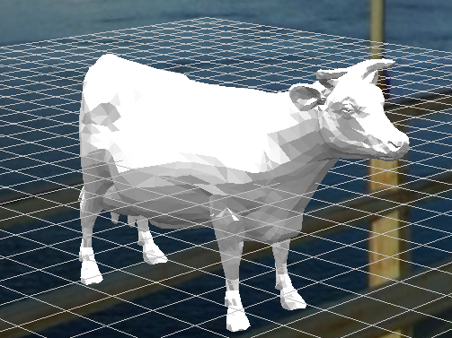

# Publish Triangular Mesh

This example demonstrates a complete workflow for publishing a Triangular Mesh geoscience object to Evo using the Evo Python SDK:

1. **Authenticate** with Evo using your app credentials
2. **Load mesh geometry** from an OBJ file
3. **Build mesh components** for vertices, indices, and bounding box
4. **Upload referenced Parquet data** and create the object in Evo
5. **Open the object in the Evo Portal** to verify the result

## Overview

The notebook reads mesh vertex and face data from an OBJ file and converts it into a `TriangleMesh` geoscience object that can be stored and viewed in an Evo workspace.

The workflow shows how to:

- Create authenticated SDK clients (`ObjectAPIClient` and data client)
- Parse OBJ vertices and face indices into arrays
- Build schema-compatible mesh components
- Assemble and publish a `TriangleMesh_V2_1_0` object
- Generate a direct portal link to the created object

## Dataset Characteristics

This sample uses:

- `sample-data/cow.obj`

The notebook derives:

- **Vertex coordinates** (`X`, `Y`, `Z`)
- **Triangle indices** (`X`, `Y`, `Z` index triplets)
- **Object bounding box** from vertex extents

## Object Schema

This notebook creates a triangular mesh object using `TriangleMesh_V2_1_0` from `evo-schemas`.

Key schema-aligned components created in the workflow include:

- `Triangles_V1_2_0_Vertices`
- `Triangles_V1_2_0_Indices`
- `BoundingBox_V1_0_1`
- Coordinate reference system metadata (EPSG code)

## Requirements

- Python 3.10+
- Seequent account with Evo entitlement
- Evo application credentials (client ID and redirect URL)

## Quick Start

1. Open `publish-triangular-mesh.ipynb` in Jupyter
2. Update `client_id` and `redirect_url` with your Evo app credentials
3. Confirm the OBJ input file path points to the provided sample data
4. Run all notebook cells to publish the triangular mesh object
5. Use the generated link to open the object in the Evo Portal
